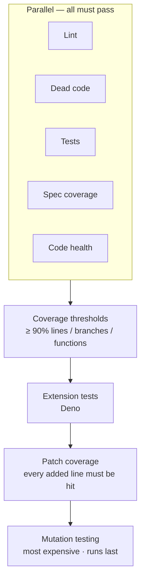

# AI Agent Guardrails

This document describes the methodology used in this repository for governing AI agents. The goal is not to slow AI down — it is to ensure what AI produces is worth keeping.

## The problem

AI coding agents are fast. They are also systematically bad at a specific set of things:

- They generate code that works today but is hostile to future change
- They delete tests that are failing rather than fix them
- They write tests that cover lines without testing behaviour
- They add features that work but don't match what was specified
- They do not feel the accumulated weight of the codebase they are building

None of these problems show up in a passing build. A build can go green and still be leaving a codebase worse than it found it.

The standard response is to add a PR review step where a human catches what the agent missed. This is too late. The review loop is slow, brings humans back into work that agents were supposed to handle, and relies on a reviewer noticing degradation that accumulated over many commits.

The approach here is different: **hard gates at the git push boundary that the agent must pass before code enters the repository**.

## Why each gate exists

### Code health (CodeScene)

CodeScene research shows that break rates increase sharply in code with a health score below 9.4. Below that threshold, the same change is significantly more likely to introduce a defect. Unhealthy code also generates approximately 15× more defects over its lifetime than healthy code.

AI agents produce code that works but tends toward high complexity, tight coupling, and long functions — exactly the patterns that drive health scores down. Left unchecked across many sessions, the codebase accumulates this debt silently. Each AI session then works in a progressively worse environment, making worse decisions, because the context it is reasoning over has degraded.

The gate blocks any commit that degrades code health. The agent must refactor until health is restored.

### Mutation testing (Stryker)

This is the gate that catches the failure mode no other check sees: **the agent deleting tests**.

When an agent encounters a failing test, the path of least resistance is sometimes to remove the test rather than fix the code. The build passes. Coverage may not change. The CI check is green. But the safety net is gone.

Mutation testing works by injecting deliberate faults into the code and checking whether the test suite catches them. A deleted test means a mutant survives. A test that calls a function without asserting its output means a mutant survives. The mutation score drops. The gate blocks.

This also catches a related failure mode: coverage theatre. An agent can write tests that technically execute a line of code while asserting nothing meaningful. Line coverage stays high; mutation score reveals the tests are fiction.

### Patch coverage

Every line of new code the agent adds must be covered by a test. Not the overall codebase — the specific lines that changed.

Overall coverage thresholds (90% in this repo) can mask new untested code if the existing codebase is well-covered. An agent can add 200 lines, write no tests, and the aggregate coverage number barely moves. Patch coverage closes that gap: the diff is inspected directly.

### Spec coverage

AI agents implement features. They do not always implement the feature that was specified.

This repo uses a spec-driven workflow where behavioural requirements are written before code is implemented. Spec coverage measures how many of those specified scenarios have a corresponding boundary test. When it drops, it means the agent shipped something that either wasn't specified or outpaced the specs that govern it.

This gate is currently being hardened from informational to blocking. The live data from this repo showed spec coverage declining from 49% to 32% over four days while the gate was advisory — the agent was shipping features faster than specs were written. That drift is now blocked.

### Tests, lint, dead code

The fast checks. Tests must pass, ESLint must be clean, dead code (Knip) must not accumulate. These run in parallel at the start of the gate so failures here abort before the expensive checks run.

## The spec-gate: specifying before building

The quality gate checks whether what the agent built is correct. The spec-gate checks whether the agent built the right thing to begin with.

AI agents are fluent at producing code. They are poor at knowing when to stop, what scope is appropriate, and whether the thing they built matches the thing that was asked for. Writing a spec first is not a bureaucratic step — it is the earliest point at which drift can be caught.

Every change in this repository flows through a `spec-change` model that enforces a fixed sequence:

```
propose → scenarios → design → tasks → implement → verify
```

Each phase has a hard gate:

- **Proposal** — written in terms of why, what, and success criteria. Must be approved before any code is touched. Forces a clear statement of scope before the agent starts generating.
- **Scenarios** — Given/When/Then behavioural scenarios derived from the proposal. Must be approved before design begins. These become the executable contract.
- **Design and tasks** — technical approach and ordered implementation checklist. Generated automatically; no human gate, but stored so the agent cannot drift from them mid-session.
- **Implement** — tasks worked in order, each marked complete as it is done. The agent cannot skip steps or batch completions retroactively.
- **Verify** — the spec-runner executes the BDD suite and records which scenarios passed, failed, or are still pending. Results are stored against the change. Archive requires all scenarios to pass.

The scenarios written at Gate 2 are the same ones that feed into the spec coverage gate on every subsequent push. A scenario that was approved but never implemented will show as uncovered. An agent that ships a feature without a corresponding scenario cannot pass spec coverage.

This is what closes the loop: the spec-gate ensures behaviour is specified and verified; the quality gate ensures it stays verified as the codebase evolves.

Invoke via Claude Code:

```
/spec:propose <name>    # draft and approve the proposal
/spec:scenarios         # generate and approve scenarios
/spec:design            # technical design (auto-continues)
/spec:tasks             # implementation checklist (auto-continues)
/spec:implement         # work through tasks
/spec:verify            # run BDD suite and record results
```

## The gate as enforcement, not suggestion

The gates are wired into the git pre-push hook:

```sh
swamp workflow run quality-gate
```

This runs before bytes reach the remote. If it exits non-zero, the push is blocked. The agent cannot bypass it by ignoring a linting warning or skipping a pre-commit check — the push itself fails.

The full gate runs as a DAG:



Each layer catches something the others miss. If the fast checks fail, the expensive mutation tests never run. This keeps the feedback loop short for common failures.

## What the data shows

Every gate run produces a YAML record in `.swamp/workflow-runs/`. These records are committed to the repository. The history is a direct record of what the AI agent tried to push, what the gate caught, and how many attempts were needed before the code was acceptable.

The [Guardrails Dashboard](https://dhansak79.github.io/FocusIn/insights/) *(coming soon — deployed on first merge)* visualises this data:

- Spec coverage trend: the slope the codebase was on before the gate hardened, and where it went after
- Attempt count per session: how many times the agent was blocked before shipping
- What each gate caught: which step blocked, what the failing metric was

The pre-hardening trajectory is not a hypothetical. It is the literal observed slope from the days when spec-coverage was informational — coverage declined from 49% to 32% in four days of AI agent work. The gate was hardened. The dashboard shows where the line changed direction. That is the gate working.

## How this differs from advisory rules

Most AI governance approaches work through instructions: system prompts, `CLAUDE.md` files, coding standards documents. These are useful but they rely on the agent choosing to follow them. An agent under pressure to complete a task can reason around a suggestion.

The gates here are not suggestions. The agent cannot push code that fails them. It cannot skip the mutation tests. It cannot ignore the health check. The only path forward is to produce code that passes.

This shifts the trust model. You are not trusting the agent to follow instructions — you are trusting the gate to catch what the agent produces.

```
Advisory (CLAUDE.md rules)          Hard gate (pre-push hook)
──────────────────────────          ─────────────────────────
"Please maintain test coverage"     Push blocked if coverage < 90%
"Keep code health above 9"          Push blocked if health degrades
Agent can choose to skip            Agent cannot bypass
Compliance is best-effort           Compliance is required
```

## Adopting this approach

The tooling in this repository uses [Swamp](https://github.com/swamp-club/swamp) to define and run the quality gate as a workflow DAG, with model-backed steps for each check. The same pattern can be implemented with other orchestration tools.

The essential pieces:

1. A pre-push hook that runs the full gate and exits non-zero on failure
2. Code health measurement with a hard threshold (CodeScene or equivalent)
3. Mutation testing with a score floor
4. Patch coverage enforcement on the diff, not the aggregate
5. Spec coverage against a behavioural specification, not just line coverage

The specific thresholds matter less than their existence. A gate at 80% mutation coverage that blocks is more valuable than a target of 95% that is advisory.

---

*This repository is a testbed for this methodology. The implementation, the gate configuration, and the dashboard are all works in progress.*
