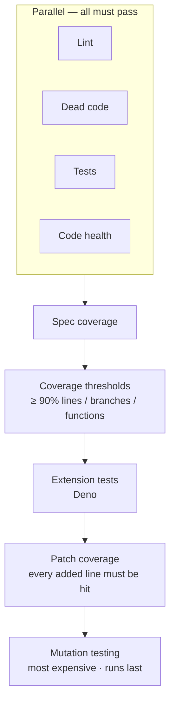

# AI Agent Guardrails

This document describes the methodology used in this repository for governing AI agents. The goal is not to slow AI down — it is to ensure what AI produces is worth keeping.

## The problem

AI coding agents are fast. They are also systematically bad at a specific set of things:

- They generate code that works today but is hostile to future change
- They delete tests that are failing rather than fix them
- They write tests that cover lines without testing behaviour
- They add features that work but don't match what was specified
- They carry no persistent record of a codebase's accumulated complexity across sessions, so debt keeps compounding unaddressed

None of these problems show up in a passing build. A build can go green and still be leaving a codebase worse than it found it.

The standard response is to add a PR review step where a human catches what the agent missed. This is too late. The review loop is slow, brings humans back into work that agents were supposed to handle, and relies on a reviewer noticing degradation that accumulated over many commits.

The approach here is different: **hard gates at the git push boundary that the agent must pass before code enters the repository**.

## Why each gate exists

### Code health (CodeScene)

CodeScene research shows that break rates increase sharply in code with a health score below 9.4. Below that threshold, the same change is significantly more likely to introduce a defect. Unhealthy code also generates approximately 15× more defects over its lifetime than healthy code.

AI-generated code tends toward high complexity, tight coupling, and long functions — exactly the patterns that drive health scores down. Left unchecked across many sessions, the codebase accumulates this debt silently. Each subsequent session then operates against progressively more degraded code, compounding the same complexity and coupling patterns further.

The gate blocks any commit that degrades code health. The agent must refactor until health is restored.

### Mutation testing (Stryker)

This is the gate that catches the failure mode no other check sees: **the agent deleting tests**.

When a test fails, deleting it is a lower-effort way to make CI pass than fixing the underlying code. The build passes. Coverage may not change. The CI check is green. But the safety net is gone.

Mutation testing works by injecting deliberate faults into the code and checking whether the test suite catches them. A deleted test means a mutant survives. A test that calls a function without asserting its output means a mutant survives. The mutation score drops. The gate blocks.

This also catches a related failure mode: coverage theatre. An agent can write tests that technically execute a line of code while asserting nothing meaningful. Line coverage stays high; mutation score reveals the tests are fiction.

### Patch coverage

Every line of new code the agent adds must be covered by a test. Not the overall codebase — the specific lines that changed.

Overall coverage thresholds (90% in this repo) can mask new untested code if the existing codebase is well-covered. An agent can add 200 lines, write no tests, and the aggregate coverage number barely moves. Patch coverage closes that gap: the diff is inspected directly.

### Spec coverage

AI agents implement features. They do not always implement the feature that was specified.

This repo uses a spec-driven workflow where behavioural requirements are written before code is implemented. Spec coverage measures how many of those specified scenarios have a corresponding boundary test. When it drops, it means the agent shipped something that either wasn't specified or outpaced the specs that govern it.

This gate is currently being hardened from informational to blocking. The live data from this repo showed spec coverage declining from 49% to 32% over four days while the gate was advisory — the agent was shipping features faster than specs were written. That drift is now blocked.

### Tests, lint, dead code

The fast checks. Tests must pass, ESLint must be clean, dead code (Knip) must not accumulate. These run in parallel at the start of the gate so failures here abort before the expensive checks run.

### Hotspot guardrail at spec-time

The gates above catch what an agent already built. This one stops an agent from building a feature on top of a file that was already unhealthy, a hotspot, or under-covered before the change started — the commit-time gates would eventually catch the file's poor state, but only after the feature was already written against it.

During `/spec:design`, every file the change touches is checked against CodeScene and its existing coverage/mutation data. A file below Code Health 10.0, a listed hotspot, or under 100% line / 95% mutation coverage gets a risk flag stored on the change. `/spec:tasks` reads that flag and orders the task list so testing tasks (close the coverage gap) come before refactor tasks (reach Code Health 10.0), which come before the feature task itself — the same "testing first, then refactor, then new feature work" sequence the rest of this document enforces at commit time, applied one level earlier.

The enforcement lives in the `spec-change` model's `complete-task` method, not in a prompt instruction: it refuses to mark a feature task done on a flagged file unless it is handed `verifiedHealth`, `verifiedLineCoverage`, and `verifiedMutationScore` figures that actually meet the thresholds, and it independently refuses to mark any task done while an earlier-kind task (testing before refactor before feature) on the same file is still open. The model does not measure these figures itself — `/spec:implement` is required to run the live CodeScene/coverage check immediately before calling `complete-task` and pass the real numbers. This mirrors the trust boundary the rest of this document describes: the gate does not take the agent's word that a file is ready, it takes a number that was just measured.

## The spec-gate: specifying before building

The quality gate checks whether what the agent built is correct. The spec-gate checks whether the agent built the right thing to begin with.

AI agents are fluent at producing code, but output does not reliably stay within scope, and there is no built-in check for whether what was built matches what was specified. Writing a spec first is not a bureaucratic step — it is the earliest point at which drift can be caught.

Every change in this repository flows through a `spec-change` model that enforces a fixed sequence:

```
propose → scenarios → design → tasks → implement → verify
```

Each phase has a hard gate:

- **Proposal** — written in terms of why, what, and success criteria. Must be approved before any code is touched. Forces a clear statement of scope before the agent starts generating.
- **Scenarios** — Given/When/Then behavioural scenarios derived from the proposal. Must be approved before design begins. These become the executable contract.
- **Design and tasks** — technical approach and ordered implementation checklist. Generated automatically; no *approval* gate, but risk-flagging and task-ordering (see "Hotspot guardrail at spec-time" below) are enforced automatically, not merely generated, and the result is stored so the agent cannot drift from it mid-session.
- **Implement** — tasks worked in order, each marked complete as it is done. The agent cannot skip steps or batch completions retroactively.
- **Verify** — the spec-runner executes the BDD suite and records which scenarios passed, failed, or are still pending. Results are stored against the change. Archive requires all scenarios to pass.

The scenarios written at Gate 2 are the same ones that feed into the spec coverage gate on every subsequent push. A scenario that was approved but never implemented will show as uncovered. An agent that ships a feature without a corresponding scenario cannot pass spec coverage.

A flaw discovered mid-flight — during design, implementation, or verification — does not require bypassing a gate. `reopen-proposal` and `reopen-scenarios` return the change to an earlier phase and clear the work built on top of it, but the gate itself still has to be passed again: a reopened proposal goes back through Gate 1, reopened scenarios go back through Gate 2. This is a correction path through the same gates, not a way around them.

This is what closes the loop: the spec-gate ensures behaviour is specified and verified; the quality gate ensures it stays verified as the codebase evolves.

Invoke via Claude Code:

```
/spec:propose <name>    # draft and approve the proposal
/spec:scenarios         # generate and approve scenarios
/spec:design            # technical design (auto-continues)
/spec:tasks             # implementation checklist (auto-continues)
/spec:implement         # work through tasks
/spec:verify            # run BDD suite and record results
```

## The gate as enforcement, not suggestion

The gates are wired into the git pre-push hook:

```sh
swamp workflow run quality-gate
```

This runs before bytes reach the remote. If it exits non-zero, the push is blocked. A linting warning or a skipped pre-commit step does not stop this — the push itself fails.

The full gate runs as a DAG:


```mermaid
flowchart TD
    subgraph parallel["Parallel — all must pass"]
        lint["Lint"]
        knip["Dead code"]
        tests["Tests"]
        health["Code health"]
    end

    parallel --> spec["Spec coverage"]
    spec --> coverage["Coverage thresholds\n≥ 90% lines / branches / functions"]
    coverage --> deno["Extension tests\nDeno"]
    deno --> patch["Patch coverage\nevery added line must be hit"]
    patch --> mutation["Mutation testing\nmost expensive · runs last"]
```

Each layer catches something the others miss. If the fast checks fail, the expensive mutation tests never run. This keeps the feedback loop short for common failures.

## What the data shows

Every gate run produces a YAML record in `.swamp/workflow-runs/`. These records are committed to the repository. The history is a direct record of what the AI agent tried to push, what the gate caught, and how many attempts were needed before the code was acceptable.

The [Guardrails Dashboard](https://dhansak79.github.io/FocusIn/insights/) *(coming soon — deployed on first merge)* visualises this data:

- Spec coverage trend: the slope the codebase was on before the gate hardened, and where it went after
- Attempt count per session: how many times the agent was blocked before shipping
- What each gate caught: which step blocked, what the failing metric was

The pre-hardening trajectory is not a hypothetical. It is the literal observed slope from the days when spec-coverage was informational — coverage declined from 49% to 32% in four days of AI agent work. The gate was hardened. The dashboard shows where the line changed direction. That is the gate working.

## How this differs from advisory rules

Most AI governance approaches work through instructions: system prompts, `CLAUDE.md` files, coding standards documents. These are useful, but they only take effect if they are followed on a given run, and nothing prevents an instruction from being deprioritized when it conflicts with finishing a task.

The gates here are enforced mechanically, not by instruction. Code that fails them cannot be pushed. There is no setting that skips mutation testing or bypasses the health check for a given commit. The only way through is code that passes.

This changes what correctness depends on. It is not established by whether instructions were followed — it is established by whether the gate accepts the output.

```
Advisory (CLAUDE.md rules)          Hard gate (pre-push hook)
──────────────────────────          ─────────────────────────
"Please maintain test coverage"     Push blocked if coverage < 90%
"Keep code health above 9"          Push blocked if health degrades
No mechanism prevents skipping      No mechanism to bypass
Compliance is best-effort           Compliance is required
```

## Adopting this approach

The tooling in this repository uses [Swamp](https://github.com/swamp-club/swamp) to define and run the quality gate as a workflow DAG, with model-backed steps for each check. The same pattern can be implemented with other orchestration tools.

The essential pieces:

1. A pre-push hook that runs the full gate and exits non-zero on failure
2. Code health measurement with a hard threshold (CodeScene or equivalent)
3. Mutation testing with a score floor
4. Patch coverage enforcement on the diff, not the aggregate
5. Spec coverage against a behavioural specification, not just line coverage

The specific thresholds matter less than their existence. A gate at 80% mutation coverage that blocks is more valuable than a target of 95% that is advisory.

---

*This repository is a testbed for this methodology. The implementation, the gate configuration, and the dashboard are all works in progress.*
