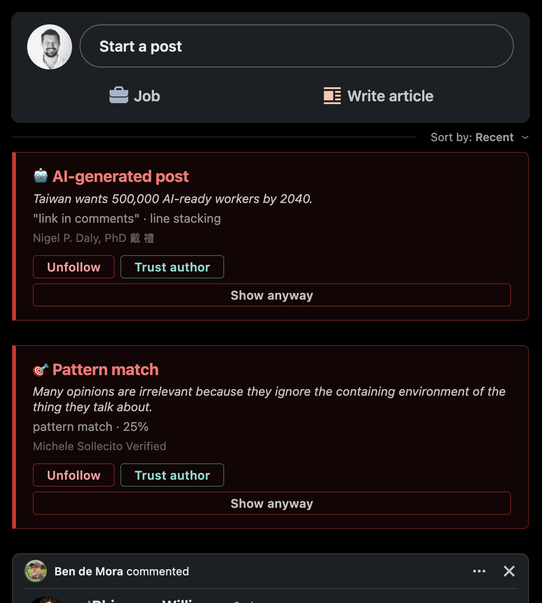
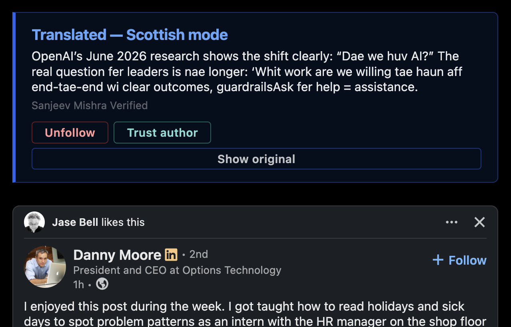

[](https://codescene.io/projects/81232)[](https://codescene.io/projects/81232)[](https://codescene.io/projects/81232)[](https://github.com/dhansak79/FocusIn/actions/workflows/mutation.yml)

# FocusIn: LinkedIn Attention Filter

In early 2026 a barrier was crossed: the majority of LinkedIn posts were AI-generated. 53.7% to be specific.

You can feel it when you scroll. The same rhythm, the same phrases, the same staccato lines. A thousand people who learned to write by prompting the same model, all publishing into the same feed.

FocusIn filters that out. Posts that match enough AI writing patterns get collapsed to a one-line summary with a reveal button. You can still read them. You just don't have to scroll through a wall of them to find the ones worth reading.

> Forked from [njelich/LinkOff](https://github.com/njelich/LinkOff)



## How it works

The detector scans for patterns: em dashes, emoji bullets, hook/contrast structures, buzzword phrases, single-sentence line stacking. Each signal is weighted. Cross the threshold and the post collapses. The summary tells you which signals matched.

A second pass runs a local classifier against structural archetypes of AI writing, for posts that clear the pattern checks but still read like no one wrote them.

There is also a semantic topic filter that hides posts by meaning rather than exact words, using an embedding model that runs entirely in your browser. "Hustle culture" catches posts about it even when that phrase never appears. Built-in presets cover hustle culture, personal branding, motivational quotes, cryptocurrency, job interview tips, AI productivity tools, startup success stories, sales content, political content, and war and conflict. All are off by default. You can also add your own topics.

A tone filter runs a sentiment classifier on each post and collapses those with a high negative-tone score. Sensitivity is adjustable (default 70%). It is off by default and downloads a ~17 MB model on first use.

And a keyword filter, for when you just want anything mentioning a specific word gone.

When a post is collapsed, the banner shows which filter fired, the author's name, and two action buttons: **Unfollow** to unfollow the author on LinkedIn, and **Trust author** to add them to a whitelist so their posts are never collapsed again.

### Scottish mode

Scottish mode overrides every filter above. Instead of collapsing a flagged post behind a banner, it rewrites it — buzzwords and filler stripped, re-rendered as a plain-spoken summary in Scots dialect — entirely on-device via a local summarization model plus a deterministic Scots word lexicon. The original post is never touched; a "Show original" toggle reveals it in place, and the rewrite card carries the same author info and **Unfollow**/**Trust author** actions as the standard banner. Off by default; downloads a local model on first use.



## Signal table

| Signal | Notes |
|---|---|
| **Buzzword phrases** | "game-changer", "let that sink in", "thought leadership", "delve", "leverage" (two or more triggers) |
| **Contrast structures** | "It's not X. It's Y." hook/punchline pairs |
| **Listicle titles** | "7 habits that...", numbered thread formats |
| **Arrow bullet lists** | arrows used as bullets |
| **Em dash** | Rarely typed by hand; very common in AI output |
| **Emoji overload** | More than 4 emoji in a post |
| **Emoji bullets** | Two or more lines each opening with an emoji |
| **Raw markdown** | `**bold**`, `# headers`, `* bullets` pasted straight from a chatbot |
| **Line stacking** | Short single-sentence lines throughout |

## Install

**Firefox**

1. Type `about:debugging` in the URL bar and press <kbd>Enter</kbd>
2. Click **This Firefox** then **Load Temporary Add-on...**
3. Navigate to the unzipped folder and select `manifest.json`

**Chromium**

1. Type `chrome://extensions` in the URL bar and press <kbd>Enter</kbd>
2. Enable **Developer mode**
3. Click **Load Unpacked** and select the unzipped folder

## FAQ

### Why was my post collapsed?

It matched enough signals. One is rarely enough; the detector is looking for patterns that cluster together. The summary on the collapsed post shows exactly which ones fired.

### Does any of this send my data anywhere?

No. Everything runs in your browser.

### What is the difference between the keyword filter and the semantic topic filter?

The keyword filter is exact match. The semantic filter understands meaning, so it catches posts about a topic even when the specific words you typed never appear. It is slower and less precise; use it for themes that are hard to pin down with a word list.

## AI-assisted development

This project uses [Claude Code](https://claude.ai/code) as the primary coding assistant, with hard quality gates enforcing code health, mutation testing, patch coverage, and spec coverage on every push. See [GUARDRAILS.md](GUARDRAILS.md) for the full methodology — why each gate exists, what failure modes it catches, and how this differs from advisory rules in a `CLAUDE.md`. See [TECHNICAL_DESIGN.md](TECHNICAL_DESIGN.md) for how the product itself is architected — which models back each filter and why, the message-passing/rendering design, and the spec-change model's state machine in full.

[CodeScene](https://codescene.io) provides code health measurement.

**Spec-Gate** enforces a spec-driven process for every change. Before implementing a feature, `/spec:propose` drafts a proposal (Gate 1) and `/spec:scenarios` produces Given/When/Then scenarios (Gate 2). Both gates must be approved before any code is written. Feature files are generated from the approved scenarios and run as part of the test suite. Every change's full history (proposal, scenarios, design, tasks, verification results) lives in its `spec-change` model state — see [TECHNICAL_DESIGN.md](TECHNICAL_DESIGN.md#how-a-change-is-specified-gated-and-shipped) for the full mechanics. (The repo's `openspec/` directory predates this and is no longer updated — legacy only.)

## Development

### Setup

The quality gates and spec-gate tooling depend on three CLIs that aren't installed via `npm`:

- **[swamp](https://github.com/swamp-club/swamp)** (`~/.swamp/bin/swamp`) — runs the quality-gate/spec-gate workflows and the `spec-change` model.
- **[Deno](https://deno.com)** (bundled at `~/.swamp/deno/deno`) — runs the extension model tests in `extensions/models/`.
- **[CodeScene CLI](https://codescene.io)** (`~/.local/bin/cs`) — powers the code health gate. (`cs-mcp`, the MCP server used by the CodeScene Claude Code plugin, installs separately via npm and is usually already on `PATH`.)

Add all three to your shell's `PATH` (e.g. in `~/.zshrc` or `~/.bashrc`):

```sh
export PATH="$HOME/.swamp/bin:$HOME/.swamp/deno:$HOME/.local/bin:$PATH"
```

If you're working in this repo via Claude Code, the equivalent is already configured in `.claude/settings.local.json`'s `env.PATH` — it takes effect on your *next* session, not the one where you added it.

**`swamp` and the CodeScene CLI are local-only** — they drive the `.githooks/pre-commit`/`pre-push` hooks and are not installed in any GitHub Actions workflow. CI runs its own equivalent checks with their own separate setup instead: `.github/workflows/test.yml` installs Deno via `denoland/setup-deno` (a plain upstream Deno, not the swamp-bundled copy) to run the `extensions/models/` tests, and installs the CodeScene coverage tool via its own script; `.github/workflows/bdd.yml` and `mutation.yml` run on plain Node with no `swamp` install step at all. Don't write a Cucumber step, test, or hook that shells out to `swamp` or `cs` expecting it to work in CI — it won't.

| Command | Purpose |
|---|---|
| `npm test` | Unit tests |
| `npm run coverage` | Unit tests with coverage report |
| `npm run knip` | Dead code check |
| `npm run mutate` | Mutation tests |

### Swamp workflows

Both git hooks run declarative swamp workflows (`workflows/*.yaml`), each a DAG of jobs wired to swamp model methods. `swamp workflow run <name>` executes one directly; `.githooks/pre-commit` and `.githooks/pre-push` call them automatically. Every job/step is itself a swamp model method (`focusin-lint → check`, `focusin-tests → coverage`, etc.) — `swamp model type describe <type> --json` shows each one's exact inputs/outputs.

**`quality-gate-fast`** — pre-commit, every `git commit`:

| Job | Depends on | Steps |
|---|---|---|
| `check` | — | `lint` (ESLint) · `knip` (dead code) · `tests` (vitest) · `codescene-health` (`cs delta main`) · `spec-coverage` (no `@wip` scenarios left) — run in parallel |
| `coverage` | `check` | vitest coverage, gated at 90% lines/branches/functions/statements |
| `deno-ext` | `coverage` | `deno test` on `extensions/models/`, lcov appended to the combined coverage report |
| `patch-coverage` | `deno-ext` | Every line changed in the **staged diff** and the **full branch diff vs `main`** must be covered |

**`quality-gate`** — pre-push, every `git push`:

| Job | Depends on | Steps |
|---|---|---|
| `check` | — | `lint` · `knip` · `tests` (vitest **and** Cucumber, excluding `@wip`) · `codescene-health` — parallel; `spec-coverage` is *not* a step here, unlike the fast pipeline |
| `spec-coverage` | `check` | Runs as its own job, in parallel with `coverage` |
| `coverage` | `check` | vitest coverage, gated at 90% lines/branches/functions/statements |
| `deno-ext` | `coverage` | `deno test` on `extensions/models/`, lcov appended to the combined coverage report |
| `patch-coverage` | `deno-ext` | Full **branch diff vs `main`** only (no separate staged-diff check here) |
| `mutation` | `patch-coverage` (must succeed) | Stryker mutation testing, 95% break threshold |
| `dashboard` | `mutation` (runs even if it failed) | Regenerates `reports/workflow-insights/index.html` from synced telemetry, then auto-commits any new telemetry YAML as a separate `telemetry: sync` commit |

**`spec-gate`** — run via `/spec:verify`, not a git hook:

`generate-features` (writes `@wip`-tagged Gherkin from the change's approved scenarios) → `run-runner` (executes Cucumber through a dedicated `cucumber.spec-gate.mjs` config — deliberately without `cucumber.mjs`'s `not @wip` filter, so a scenario's first real run can actually happen and get recorded) → `record-results` (reads the Cucumber report, updates each scenario's status, advances the change to `verifying`).

The latest [mutation report](https://dhansak79.github.io/FocusIn/), [guardrails dashboard](https://dhansak79.github.io/FocusIn/insights/) (which flags declining quality trends across the last 10 quality-gate runs), and [BDD report](https://dhansak79.github.io/FocusIn/cucumber/) are published to GitHub Pages on each merge to `main`.
