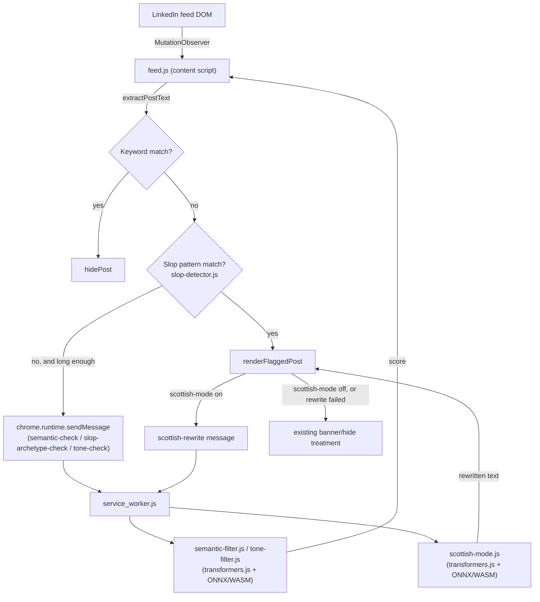

# Technical Design

How FocusIn actually works under the hood: product architecture, data flow,
the models behind each filter (what each one is, why it was picked over the
alternatives, where the tradeoffs are), and the mechanics of how a change is
specified, gated, and shipped in this repo. For the *rationale* behind that
process — why a spec-gate exists at all, why each quality gate exists, what
failure mode it catches — see [GUARDRAILS.md](GUARDRAILS.md) instead; this
document covers how the pieces actually work.

## Architecture overview

FocusIn is a Manifest V3 browser extension with three pieces:

- **Content script** (`src/features/feed.js`, injected on `linkedin.com`) — owns the DOM. Scans the feed via `MutationObserver`, extracts post text, and decides which treatment (if any) a post gets.
- **Service worker** (`src/service_worker.js`) — owns all local ML inference. Loaded once per browser session, holds the loaded models in memory, and responds to messages from the content script.
- **Popup** (`src/popup/`) — settings UI, reads/writes `chrome.storage.local` directly.

Everything runs locally. There is no backend, no telemetry, no network call
other than the one-time model downloads from Hugging Face (already
whitelisted in `manifest.json`'s `host_permissions`).



### Why inference lives in the service worker, not the content script

All three ML modules (`semantic-filter.js`, `tone-filter.js`,
`scottish-mode.js`) are imported by `service_worker.js`, not `feed.js`. The
content script only ever talks to them through `chrome.runtime.sendMessage`.
Reasons:

- **One model instance, not one per tab.** LinkedIn is a single-page app;
  navigating around it doesn't reload the content script, but opening a
  *second* LinkedIn tab would inject a second content script instance. Model
  loading (and its memory footprint) stays centralized in the one shared
  service worker rather than being duplicated per tab.
- **Separation of concerns.** `feed.js` is already a large file dealing with
  fragile, ever-changing LinkedIn DOM selectors. Keeping ML loading/inference
  entirely out of it means DOM changes and model changes are decoupled.

The cost is message-passing latency and the complexity that comes with async
callbacks — visible in `feed.js`'s `sendSemanticMessage` helper and the
loading-placeholder handling in Scottish mode's `attemptScottishRewrite`.

## The models, and why each one

Every model below runs through
[`@xenova/transformers`](https://github.com/xenova/transformers.js) (ONNX
Runtime compiled to WASM), quantized, entirely client-side.

| Filter | Model | Task | Why this model |
|---|---|---|---|
| Semantic topic filter, slop archetype match | `Xenova/all-MiniLM-L6-v2` | `feature-extraction` (sentence embeddings) | Small, fast general-purpose sentence embedding model. Cosine similarity against a handful of topic strings is cheap once embedded — no need for anything bigger than a MiniLM-class model for "is this post about X" style matching. |
| Tone filter | `Xenova/distilbert-base-uncased-finetuned-sst-2-english` | `text-classification` (sentiment) | Already fine-tuned for binary sentiment (SST-2) — exactly the POSITIVE/NEGATIVE signal the filter needs, with no extra output-parsing work. Distilled BERT keeps the download (~17 MB) and inference cost low for a filter that's off by default. |
| Scottish mode: content condensing | `Xenova/distilbart-cnn-6-6` | `summarization` | See below — this replaced a general instruction model after real quality failures. |
| Scottish mode: dialect | *(no model — deterministic)* | word-substitution lexicon (`scots-lexicon.js`) | See below. |

### Scottish mode's model history (a worked example of picking the wrong tool first)

The original design used **`Xenova/LaMini-Flan-T5-77M`**, a general
instruction-following model, prompted to both strip corporate buzzwords *and*
rewrite in Scots dialect in one pass. In practice, live testing surfaced four
distinct failure modes in sequence:

1. **Prompt echo / hallucination-adjacent output** — asked to do two things
   in one instruction (simplify + translate), the model would sometimes
   regurgitate fragments of the *instruction* rather than transform the
   *content* ("I'm a Scottish dialect, I'm not a fan of corporate buzz").
2. **Degenerate repetition loops** — once `max_new_tokens` was raised enough
   to stop truncating long posts, greedy decoding without
   `no_repeat_ngram_size`/`repetition_penalty` would get stuck repeating the
   same sentence dozens of times.
3. **Premature stopping** — even with the loop fixed, the model would often
   produce two sentences and quit, regardless of `max_new_tokens`, dropping
   the rest of a long post. Consistent with a model whose instruction-tuning
   data skewed toward short Q&A-style completions.
4. **Content corruption on genuinely complex input** — multi-paragraph,
   emoji/hashtag-heavy posts got sentences merged, dropped, or subtly
   reworded in ways that changed the meaning (not just condensed it).

None of these were fixable by better prompting or generation parameters
alone — they're symptomatic of asking a 77M-parameter general-purpose model
to do two different jobs (compression *and* style transfer) it wasn't
specifically trained for. The fix was to split the two jobs and stop
expecting either model to do the other's job:

- **Condensing** moved to `Xenova/distilbart-cnn-6-6`, a model actually
  fine-tuned for summarization (trained to cover source content while
  compressing, rather than optimizing for a plausible-looking short answer).
  It takes raw post text directly — no instruction wrapper, since it isn't
  an instruction-following model.
- **Dialect** moved to a fully deterministic word-substitution pass
  (`scotticize()` in `scottish-mode.js`, data in `scots-lexicon.js`) — no
  model at all. A model this size cannot reliably do genuine style transfer
  into Scots; a curated lookup table can't hallucinate, drop content, or
  loop, by construction.

Remaining generation-time guards on the summarization call:
`no_repeat_ngram_size: 3` and `repetition_penalty: 1.3` (repetition-loop
safety net, kept even though distilbart is less prone to it),
`max_new_tokens: 300` (headroom for long posts), and a `trimToLastSentence()`
post-process step that trims a summary cut off mid-clause back to its last
complete sentence, so an abbreviated summary still reads as intentional
rather than broken.

### The Scots lexicon: why data, not more model

`src/features/scots-lexicon.js` is a flat English-word → Scots-word map
(~120 entries), curated from Wiktionary's "Glossary of Scottish slang and
jargon" (CC BY-SA 4.0) plus manual additions. It's deliberately **not**
folded into `stryker.config.json`'s mutation-testing `mutate` list, matching
the existing `slop-keywords.js` precedent — it's pure data with no branching
logic, so mutating each string literal would demand a dedicated assertion
per word for no real benefit. Multi-word and case-sensitive grammar rules
(contractions, standalone "I", "no" → "nae"/"naw" depending on whether it
precedes another word) stay hardcoded in `scottish-mode.js` instead, since a
flat word map can't express them.

Curation deliberately dropped several plausible entries for tone/safety
reasons: a slur-risk homograph in American English, a couple of words whose
common non-Scots meaning collides badly with business-post content, one that
reads as a code artifact, and one that could land as demeaning in
professional content. Word choice here is a product decision, not just a
translation exercise.

## Detection pipeline (how a post gets flagged at all)

In `feed.js`, each post runs through, in order:

1. **Keyword match** — exact substring match against user-configured
   keywords. No model involved.
2. **Slop pattern detection** (`slop-detector.js` + `slop-keywords.js`) — a
   weighted signal score (em dash, emoji density, buzzword phrases,
   line-stacking, markdown artifacts, etc.). Pure pattern matching, no model.
3. **Slop archetype match** — for posts that pass the pattern check but
   still read as AI-generated, a semantic similarity check against known
   "archetype" phrasings, using the embedding model.
4. **Semantic topic filter** — cosine similarity between the post's
   embedding and each user-configured topic's embedding.
5. **Tone filter** — sentiment classification, collapses posts above a
   configurable negative-tone threshold.

Whichever check fires first wins for a given post; only posts that clear all
of these are left alone. Every check EXCEPT keyword/pattern matching goes
through the service worker, since they need a model.

## Rendering: one DOM pattern for every treatment

Every "flagged post" outcome — the red slop banner, the semantic-match
banner, and the Scottish-mode rewrite card — uses the same underlying
mechanism: the real post element is **soft-hidden** via a CSS class
(`focusedin-slop-soft-hide`, clipped to near-zero size rather than
`display: none`, so LinkedIn's own lazy-loading logic doesn't get confused),
and a sibling element is inserted immediately before it via `post.before(...)`.
The original post's DOM — avatar, name, buttons, any native "…see more"
truncation control — is **never mutated**. This is why "show original" (in
either the slop banner's "Show anyway" or Scottish mode's toggle) always
reveals the exact real post, not a captured snapshot of it.

Scottish mode's card additionally shows an immediate "Translating…"
placeholder while the local model runs (same soft-hide + sibling-insert
mechanism), swapped for the real card once a response arrives — otherwise a
slow model call would leave the flagged content fully visible for the whole
wait, undermining the point of the feature.

## How a change is specified, gated, and shipped

Every change to this repo (this feature included) is tracked by a
`spec-change` swamp model instance — one per named change, state persisted
at `.swamp/spec-change-{name}.json` — that enforces a fixed phase sequence.
`GUARDRAILS.md` covers *why* this exists; this section is the concrete
mechanics: the state machine, what each method does, and how it wires into
the `spec-gate` workflow described in the
[README](README.md#swamp-workflows).

### Phase state machine

```
draft
  → proposal-pending-approval   (set-proposal)
  → proposal-approved           (approve-proposal)          [Gate 1]
  → scenarios-pending-approval  (set-scenarios)
  → approved                    (approve-scenarios)         [Gate 2]
  → designing                   (set-design)
  → tasking                     (set-tasks)
  → implementing                (start-implementing)
  → verifying                   (record-results)
  → archived                    (archive)
```

Every arrow is a model method call; the phase only advances on success, and
each method's `requirePhase` check refuses to run from the wrong phase (e.g.
`approve-proposal` only works from `proposal-pending-approval`). `create`
initializes a change into `draft`.

| Method | What it does |
|---|---|
| `create` | Initializes a new change in `draft` |
| `set-proposal` | Stores proposal text (why/what/success criteria), moves to `proposal-pending-approval` |
| `approve-proposal` | **Gate 1.** Refuses if proposal text is empty. Moves to `proposal-approved` |
| `set-scenarios` | Stores Given/When/Then scenarios (status `pending`), moves to `scenarios-pending-approval` |
| `approve-scenarios` | **Gate 2.** Moves to `approved` |
| `set-design` | Stores the technical design text plus any `risk_flags` (files found unhealthy/a hotspot/under-covered — see below), moves to `designing` |
| `set-tasks` | Stores the ordered implementation checklist, moves to `tasking` |
| `start-implementing` | Moves to `implementing` — no state change beyond the phase itself |
| `complete-task` | Marks one task done by id. See the hotspot guardrail below — this is where flagged-file ordering and live metric verification are enforced |
| `generate-features` | Writes `@wip`-tagged Gherkin feature files from the approved scenarios — only clears `@wip` for a scenario once it already has a real `pass`/`fail` recorded, never for one still `pending` |
| `record-results` | Reads a Cucumber JSON report, updates each scenario's status by matching on name, moves to `verifying`. Callable from `implementing` *or* `verifying`, so re-running verification doesn't require a state hand-edit |
| `archive` | Requires every scenario to be `pass`; refuses otherwise, listing which ones aren't. Moves to `archived` |
| `reopen-proposal` | Returns an approved-or-later change to `proposal-pending-approval`, clearing scenarios/design/tasks built on top |
| `reopen-scenarios` | Returns an approved-or-later change to `scenarios-pending-approval`, clearing design/tasks but keeping the approved proposal |

### The hotspot guardrail at `complete-task`

If `set-design` flagged a file (unhealthy code health, a known hotspot, or
under-covered), `complete-task` enforces two things for tasks touching that
file:

- **Ordering** — any `testing`/`refactor`-kind task on that file must be
  done before a `feature`-kind task on the same file can be marked complete.
  Marking a feature task complete while an earlier-kind sibling on the same
  file is still open throws, naming the blocking task.
- **Verified thresholds** — closing a `feature` task on a flagged file
  requires passing `verifiedHealth === 10`, `verifiedLineCoverage === 100`,
  and `verifiedMutationScore >= 95` as arguments. These have to be real,
  freshly-measured numbers (`code_health_score`, a live coverage/mutation
  run) — the gate only works if an agent can't just assert its own success.

### Claude Code entry points

```
/spec:propose <name>    # draft and approve the proposal    (Gate 1)
/spec:scenarios         # generate and approve scenarios    (Gate 2)
/spec:design            # technical design (auto-continues)
/spec:tasks             # implementation checklist (auto-continues)
/spec:implement         # work through tasks
/spec:verify            # run BDD suite and record results
```

Each command drives the model methods above; none of them skip a gate. If a
flaw is found mid-flight, re-running `/spec:propose` on an already-approved
change offers to call `reopen-proposal` (and `/spec:scenarios` likewise
offers `reopen-scenarios`) to go back through the relevant gate rather than
bypassing it.

### Where the artifacts actually live

- **Source of truth**: the `spec-change` model state itself
  (`.swamp/spec-change-{name}.json`) — phase, proposal text, scenarios,
  design, tasks, risk flags. This is the *only* place a change's full
  history lives; `archive` doesn't write anything out to git-tracked files
  beyond the feature files already generated during `verify`.
- **`tests/cucumber/features/*.feature`** — generated from the model's
  approved scenarios by `generate-features`; this is what `spec-coverage`
  checks against on every push.
- **`openspec/`** (`specs/` and `changes/archive/`) — **legacy**, from
  before this repo migrated to the swamp `spec-change` model. Nothing in the
  current spec-gate flow reads from or writes to it; the newest file in
  `openspec/specs/` predates the hotspot-guardrail-gate change, and
  `archive`'s implementation never touches `openspec/` at all. Treat it as a
  frozen historical snapshot, not a live artifact.

## Where to look next

- [README.md](README.md) — user-facing feature list, install instructions, and the swamp workflow/quality-gate reference.
- [GUARDRAILS.md](GUARDRAILS.md) — why the quality gates exist and how they function as enforcement rather than advisory rules.
- `.swamp/spec-change-*.json` — the actual decision log for every change, including the ones that motivated some of the choices above.
